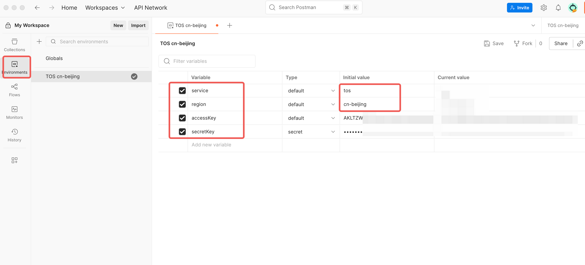

# Volc-TOS unofficial pre-request script for Postman

* It is possible to allow private files to be accessed through AK/SK, so as to use various APIs of the TOS protocol.

## Step
1. Setup an Env
    1. service
        * always `tos`
    2. region
        * eg, `cn-beijing`, `cn-shanghai`
    3. accessKey
    4. secretKey
2. Create a request and binding the Env 
3. Setup the pre-request script

## Alert
* For a POST request, like  `/?x-tos-process=aigc`, JSON should choose [body]-[raw]-[json]
* If would like to upload a file ,like `PutObject`, choose [body]-[binary]

## Notice
1. This postman script is only for VolcEngine TOS
2. TOS presign is different than VolcEngine default presign

-----

# 适用于火山引擎 TOS 对象存储 的非官方 pre-request 签名脚本

* 可以使用 AK/SK 通过 TOS API 来访问 TOS 中的私有文件

## 步骤
1. 配置 postman Env
    1. service
        * 默认 `tos`
    2. region
        * 例如 `cn-beijing`, `cn-shanghai`
    3. accessKey
    4. secretKey
2. 创建一个请求，并绑定之前创建的 Env
3. 配置 pre-request 脚本

## 提示
* 发送 POST 请求的时候， 比如 `/?x-tos-process=aigc`, Postman选择 [body]-[raw]-[json] 来传入json body
* 上传文件的时候，比如 `PutObject`，Postman选择 [body]-[binary]

## 注意
1. 本脚本仅适用于火山引擎 TOS 对象存储
2. TOS 签名与火山引擎默认签名方式不同

-----

## Image demo

* create and setup an Env

* create a request and binding the Env
* paste script.js into  [Script] - [Pre-request]

-----

## Test
| Bucket | Process |
| --- | --- |
| CreateBucket | x |
| DeleteBucket | x |
| HeadBucket | ✅ |
| ListBuckets | ✅ |
| ListObjects | ✅ |
| ListObjectsV2 | ✅ |
| ListObjectVersions | x |
| PutBucketStorageClass | x |
| GetBucketLocation | x |
| GetBucketlnfo | ✅ |
| PutBucketLifecycle | x |
| GetBucketLifecycle | ✅ |
| DeleteBucketLifecycle | x |
| PutBucketAccessMonitor | x |
| GetBucketAccessMonitor | x |
| PutBucketACL | x |
| GetBucketACL | x |
| PutBucketCORS | x |
| GetBucketCORS | x |
| DeleteBucketCORS | x |
| PutBucketlnventory | x |
| GetBucketInventory | x |
| ListBucketInventory | x |
| DeleteBucketInventory | x |
| PutBucketPolicy | x |
| GetBucketPolicy | x |
| DeleteBucketPolicy | x |
| PutBucketMirrorBack | x |
| GetBucketMirrorBack | x |
| DeleteBucketMirrorBack | x |
| PutBucketReplication | x |
| GetBucketReplication | x |
| DeleteBucketReplication | x |
| PutBucketVersioning | x |
| GetBucketVersioning | x |
| PutBucketWebsite | x |
| GetBucketWebsite | x |
| DeleteBucketWebsite | x |
| PutBucketNotification | x |
| GetBucketNotification | x |
| PutBucketNotificationV2 | x |
| GetBucketNotificationV2 | x |
| PutBucketCustom Domain | x |
| GetBucketCustom Domain | x |
| DeleteBucketCustom Domain | x |
| PutBucketEncryption | x |
| GetBucketEncryption | x |
| DeleteBucketEncryption | x |
| PutBucketTagging | x |
| GetBucketTagging | x |
| DeleteBucketTagging | x |
| PutBucketRename | x |
| GetBucketRename | x |
| DeleteBucketRename | x |
| PutBucket TransferAccelerat | x |
| GetBucket TransferAccelerat | x |
| Pm3u8 | x |
| PutBucketLogging | x |
| GetBucketLogging | x |
| TextTolmage | ✅ |
| ImageTolmage | ✅ |
| PutBucketRequestPayment | x |
| GetBucketRequestPayment | x |

| Objects | Process |
| --- | --- |
| CopyObject | x |
| DeleteObject | ✅ |
| DeleteMultiObjects | x |
| GetObject | ✅ |
| HeadObject | ✅ |
| AppendObject | x |
| PutObject | ✅ |
| PostObject | x |
| SetObjectMeta | ✅ |
| RestoreObject | x |
| RenameObject | x |
| PutObjectACL | x |
| GetObjectACL | x |
| PutObjectTagging | x |
| GetObject Tagging | x |
| Delete Object Tagging | x |
| FetchObject | x |
| PutFetchTask | x |
| GetFetchTask | x |
| PutSymlink | x |
| GetSymlink | x |

| Part | Process |
| --- | --- |
| Create MultipartUpload | x |
| UploadPart | x |
| Complete MultipartUpload | x |
| AbortMultipartUpload | x |
| UploadPartCopy | x |
| ListMultipartUploads | x |
| ListParts | x |

| Data Process | api |
| --- | --- |
| ?job_type=VideoSnapshots&media_jobs | ✅ |

| qiniu | api |
| --- | --- |
| imageView2 | ✅ |
| imageMogr2 | ✅ |

## Appendix
* TOS Sign in Header https://www.volcengine.com/docs/6349/74839
* TOS API https://www.volcengine.com/docs/6349/74837
* Thanks `Sibin Luo` for bug fixing